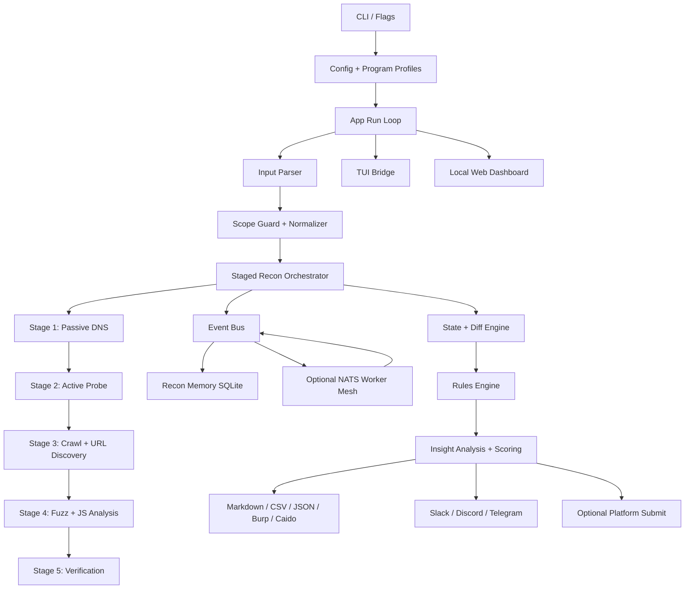

# BBPTS Architecture

## Layers

- `cmd/bbpts`: CLI parsing, config loading, telemetry startup, and mode selection.
- `internal/app`: run loop, recon/persistence/reporting phases, worker entry point, and submit safety gates.
- `internal/engine/recon`: tool adapters, staged orchestration, scope filtering, fleet dispatch, and streaming result artifacts.
- `internal/core`: config, database/storage, event bus, state, notifications, rate limiting, and platform submit clients.
- `internal/analysis`: insight derivation, scoring, evidence bundles, clustering, and report-ready findings.
- `internal/ui`: terminal/TUI views, local dashboard, and report exporters.

## Operational Notes

GitHub-hosted Actions should only build, vet, and test this repository. Continuous reconnaissance belongs on a self-hosted runner, VPS, or local Docker deployment with a private persistent volume for `bbpts.db`, reports, screenshots, and temporary tool output.
