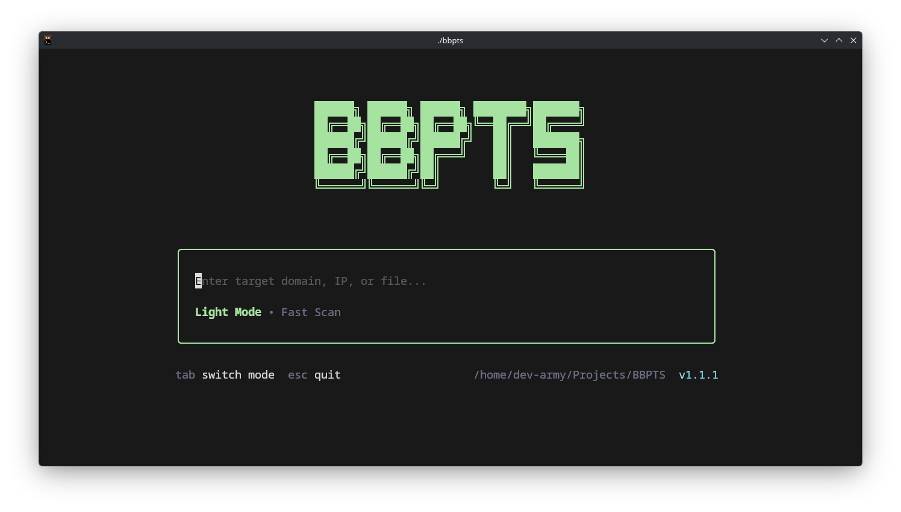

# BBPTS v1.1.0 (Bug Bounty Program Tool Set)

**Reconnaissance & Target Prioritization Toolkit**

BBPTS is a Go application for automating the early phases of bug bounty reconnaissance. It focuses on structured target ingestion, staged tool orchestration, prioritization, and export into manual testing workflows like Burp Suite.

[](https://github.com/Developer-Army/BBPTS)
[](https://golang.org/)
[](LICENSE)
[](https://codecov.io/gh/Developer-Army/BBPTS)



---

## Key Features

- **Concurrency**: Built with a panic-recovered, semaphore-backed orchestrator capable of parallelizing 15+ external security tools safely.
- **Alerting**: Notifications for **Discord, Slack, and Telegram** on higher-priority findings.
- **Distributed Fleet Support**: Optional **Axiom** integration for running supported tools across a fleet.
- **Fingerprinting**: Correlates assets using **JARM fingerprints**, favicon hashes, and SSL pattern analysis to find hidden infrastructure.
- **Structured Logging**: Native `log/slog` integration ready for CI/CD pipelines and log aggregators.
- **Prioritization**: Computes scores, tags, and suggested tests from reconnaissance events.
- **Continuous Monitoring**: Database-backed differential scanning to identify new assets and changes between runs.
- **Scope-Aware CSV Input**: Header-based CSV imports respect `scope` metadata so out-of-scope rows are not scanned.
- **Pipeline URL Preservation**: Web URLs discovered by earlier stages remain usable by URL-dependent tools like `ffuf` and `gobuster`.

---

## Table of Contents

- [Installation](#installation)
- [Quick Start](#quick-start)
- [Usage](#usage)
- [Configuration](#configuration)
- [Supported Tools](#supported-tools)
- [Output Formats](#output-formats)
- [Documentation](#documentation)
- [Contributing](#contributing)
- [License](#license)

---

## Installation

BBPTS is cross-platform and supports **Linux (Debian/RPM), macOS, and Windows**.

### Option 1: Global Install (Recommended)

```bash
# Clone the repository
git clone https://github.com/Developer-Army/BBPTS.git
cd BBPTS

# Build from source
go build -o bbpts ./cmd/bbpts

# Install globally (for all users - requires sudo)
sudo cp bbpts /usr/local/bin/
# OR user-only install (no sudo needed)
mkdir -p ~/.local/bin && cp bbpts ~/.local/bin/
# Make sure ' ~/.local/bin ' is in your PATH
echo 'export PATH="$HOME/.local/bin:$PATH"' >> ~/.bashrc
source ~/.bashrc

# Verify global installation
bbpts -doctor
```

### Option 2: Local Development Build

```bash
# Clone, setup, and build
git clone https://github.com/Developer-Army/BBPTS.git
cd BBPTS
bash scripts/setup.sh  # Installs tools and wordlists

go build -o bbpts ./cmd/bbpts

# Run from local directory
./bbpts -doctor
```

### Option 3: Using Make

```bash
git clone https://github.com/Developer-Army/BBPTS.git
cd BBPTS

# Build and install for current user (uses ~/.local/bin by default)
make install-user

# OR build and install system-wide
make install

bbpts -doctor
```

### Option 4: Go Install

```bash
# Install directly to $GOPATH/bin
go install github.com/Developer-Army/BBPTS/cmd/bbpts@latest

# Make sure $GOPATH/bin is in PATH
echo 'export PATH="$GOPATH/bin:$PATH"' >> ~/.bashrc && source ~/.bashrc

bbpts -doctor
```

### Windows Installation

```batch
# Clone the repository
git clone https://github.com/Developer-Army/BBPTS.git
cd BBPTS

# Run the Windows setup (installs deps, tools, and wordlists)
scripts\setup.bat

# Build the binary
go build -o bbpts.exe .\cmd\bbpts

# Run diagnostics to verify your environment
.\bbpts.exe -doctor
```

**Windows Prerequisites:**
- **Go 1.22+** (add to PATH)
- **Git Bash** or **PowerShell** for running scripts
- **Npcap/WinPcap** for network scanning tools (naabu, etc.)

**Note:** Ensure `%USERPROFILE%\go\bin` is in your PATH to access installed tools.

### Docker Installation

```bash
# Build the Docker image
docker build -t bbpts .

# Run BBPTS in Docker
docker run --rm \\
 -v $(pwd)/targets.example.txt:/app/targets.txt:ro \\
 -v $(pwd)/results:/app/results \\
 bbpts -i /app/targets.txt
```

---

## Quick Start

After installing globally with any method above:

```bash
# Run a full reconnaissance scan
bbpts -i targets.txt

# Quick light mode scan
bbpts -i targets.txt --light

# Full mode with all tools
bbpts -i targets.txt --full

# Run specific tools
bbpts -i targets.txt -t subfinder,httpx,nuclei

# Generate reports
bbpts -i targets.txt -o results/report.md -s results/summary.csv

# Continuous monitoring
bbpts -i targets.txt -scope my-program -cron 60
```

### Windows Installation

```batch
# Clone the repository
git clone https://github.com/Developer-Army/BBPTS.git
cd BBPTS

# Run the Windows setup (installs deps, tools, and wordlists)
scripts\setup.bat

# Build the binary
go build -o bbpts.exe .\cmd\bbpts

# Run diagnostics to verify your environment
.\bbpts.exe -doctor
```

**Windows Prerequisites:**
- **Go 1.22+** (add to PATH)
- **Git Bash** or **PowerShell** for running scripts
- **Npcap/WinPcap** for network scanning tools (naabu, etc.)

**Note:** Ensure `%USERPROFILE%\go\bin` is in your PATH to access installed tools.

### Docker Installation

```bash
# Build the Docker image
docker build -t bbpts .

# Run BBPTS in Docker
docker run --rm \
 -v $(pwd)/targets.example.txt:/app/targets.txt:ro \
 -v $(pwd)/results:/app/results \
 bbpts -i /app/targets.txt
```

---

## Quick Start

1. **Prepare your targets**: Copy `targets.example.txt` and replace the `example.com` entries with domains or URLs you are authorized to test.

2. **Run reconnaissance**:
 ```bash
 ./bbpts -i targets.txt
 ```

3. **Generate reports**:
 ```bash
 ./bbpts -i targets.txt -output report.md -summary summary.csv
 ```

4. **Continuous monitoring**:
 ```bash
 ./bbpts -i targets.txt -scope my-program -cron 60
 ```

---

## Usage

### Command Line Options

```
Usage of ./bbpts:
 -config string
 Path to BBPTS config file (default "configs/config.json")
 -cron int
 Continuous monitoring interval (minutes)
 -debug
 Enable debug logging
 -diff
 Show only new findings
 -doctor
 Run environment diagnostics
 -export-burp string
 Export Burp Suite XML findings
 -i string
 Short for -input
 -input string
 Input file path
 -low-resource
 Optimize for weak hardware
 -obsidian string
 Obsidian note directory
 -output string
 Markdown report output path
 -port int
 Dashboard port (default 8080)
 -rate-limit int
 Max requests/second (default 20)
 -dry-run
 Log actions that would be taken without submitting reports
 -rules string
 Path to BBPTS rules file (default "configs/rules.json")
 -scope string
 Scope identifier for state tracking
 -summary string
 CSV summary output path
 -t string
 Comma-separated recon tools to run (short for -tools)
 -threads int
 Number of concurrent threads (default 32)
 -timeout duration
 Overall recon timeout per tool group; 0 disables the global timeout and lets each tool/context control cancellation (default 0)
 -tool string
 Comma-separated recon tools to run (short for -tools)
 -tools string
 Comma-separated recon tools to run (leave empty to run all tools)
 -tui
 Enable interactive TUI dashboard (default false)
 -auto-submit
 Submit high-priority findings to the configured bug bounty platform
 -w Short for -web
 -web
 Enable local web dashboard
```

### Input Formats

BBPTS supports multiple input formats:

- **Simple list**: One domain/URL per line
- **CSV with headers**: `url,scope,priority,tags,notes`
- **JSON**: Structured target definitions

### Examples

```bash
# Basic reconnaissance
./bbpts -i targets.txt

# Generate reports
./bbpts -i targets.txt -output results/report.md -summary results/summary.csv

# Run specific tools
./bbpts -i targets.txt -tools subfinder,httpx,nuclei

# Continuous monitoring
./bbpts -i targets.txt -scope example-com -cron 60

# Preview platform submissions without sending
./bbpts -i targets.txt -scope example-com -dry-run

# Explicit platform submission for high-priority findings only
./bbpts -i targets.txt -scope example-com -auto-submit

# Export to Burp Suite
./bbpts -i targets.txt -export-burp burp-import.xml

# Enable web dashboard
./bbpts -i targets.txt -web -port 8080
```

---

## Configuration

BBPTS uses two main configuration files:

- `configs/config.json`: Main application settings
- `configs/rules.json`: Custom event-matching rules

### Config File Structure

```json
{
 "api_keys": {
 "shodan": "",
 "censys": "",
 "securitytrails": "",
 "github": "",
 "chaos": "",
 "virustotal": "",
 "passivetotal": "",
 "binaryedge": ""
 },
 "proxies": [],
 "rate_limit": 20,
 "state_dir": "./results/state",
 "wordlists_dir": "./wordlists",
 "wordlists": {
 "dns": "dns-5k.txt",
 "directory": "raft-small-files.txt",
 "subdomain": "subdomains-top1million-5000.txt",
 "api": "api-endpoints.txt"
 },
 "threads": 32,
 "notify": {
 "telegram_bot_token": "",
 "telegram_chat_id": "",
 "discord_webhook": "",
 "slack_webhook": ""
 },
 "submit": {
 "platform": ""
 },
 "fleet": {
 "enabled": false,
 "fleet_name": "bbpts-fleet",
 "fleet_size": 10,
 "delete_after": true
 }
}
```

### Continuous Recon Safety

Do not run active reconnaissance from GitHub-hosted Actions runners. Tools such as `subfinder`, `katana`, `naabu`, and `httpx` can generate traffic from GitHub shared infrastructure, which may violate GitHub's terms and ties scan traffic back to your account. Use a self-hosted runner, a VPS, or the Docker image on infrastructure you control.

Store `bbpts.db` and other scan artifacts on a private persistent volume owned by that runner. Do not store vulnerability scan data in GitHub Actions caches or public artifacts.

Auto-submit is optional and disabled by default. BBPTS produces the same reports, CSVs, and export files whether or not automatic submission is enabled. To submit findings, set `submit.platform` to one supported platform, pass `-auto-submit`, and use `-dry-run` first to review what would be sent. BBPTS records a submission marker under the state directory to avoid resubmitting the same finding on later cron runs.

---

## Supported Tools

BBPTS orchestrates 21+ industry-standard reconnaissance tools:

### Subdomain Enumeration & DNS
- **Subfinder**: Passive subdomain discovery
- **Findomain**: Fast multi-source subdomain enumeration
- **Massdns**: Large-scale DNS resolution (A/AAAA records)
- **Amass**: Comprehensive subdomain enumeration
- **Assetfinder**: Rapid subdomain finding
- **Puredns**: High-speed DNS resolution
- **Whois**: Domain registration & contact information

### Asset Intelligence & Passive Reconnaissance
- **Shodan**: Exposed service discovery and asset fingerprinting (requires API key)
- **Wafw00f**: WAF and firewall detection
- **Trufflehog**: Secrets scanning (API keys, tokens, credentials)

### Port Scanning & Probing
- **Httpx**: Fast HTTP probing
- **Dnsx**: DNS record enumeration
- **Naabu**: Port scanning

### Content Discovery
- **Katana**: Web crawling
- **Gau**: URL collection from archives
- **Waybackurls**: Historical URL discovery
- **Hakrawler**: Fast web crawling

### Vulnerability Scanning
- **Nuclei**: Template-based vulnerability scanning
- **Dalfox**: XSS and injection detection

### Other
- **Interactsh**: Out-of-band interaction testing
- **Anew**: Deduplication utilities
- **Gf**: Pattern matching
- **Ffuf**: Fuzzing

---

## Output Formats

BBPTS supports multiple output formats:

- **Markdown Reports**: Detailed analysis with prioritization
- **CSV Summaries**: Structured data for further processing
- **Burp Suite XML**: Direct import into Burp Scanner
- **OWASP ZAP XML**: Import findings into ZAP
- **Obsidian Notes**: Knowledge base integration
- **JSON**: Programmatic access

### Sample Markdown Report

```markdown
# BBPTS Reconnaissance Report
Generated: Mon, 01 Jan 2024 12:00:00 UTC

## Summary
- Total Hosts Analyzed: 5
- High Priority Findings: 2

| Host | Score | Priority | Tags | Suggested Tests |
|------|-------|----------|------|-----------------|
| example.com | 45 | high | api,parameterized | Test for SQL injection; Parameter tampering |
```

## Compared to Alternatives

BBPTS is designed to bridge the gap between simple passive subdomain gatherers and heavy, complex scanning frameworks:

| Feature / Metric | BBPTS v1.1.0 | OWASP Amass | ProjectDiscovery Suite | Osmedeus |
|------------------|------------|-------------|-------------------------|----------|
| **Primary Goal** | Prioritized workflow orchestration | Graph-based asset mapping | Single-purpose modular tools | Automated scan pipeline |
| **Speed & Overhead** | **Medium-Fast** (concurrent Go core) | **Slow** (heavy memory graph DB) | **Fast** (focused utility command) | **Slow** (python/bash runner wrapper) |
| **Output Type** | Prioritized MD Reports, CSV, Burp XML, Interactive TUI | Graph DB, txt lists | Raw text / JSON | HTML report / file folders |
| **Prioritization** | **Yes** (automated risk scoring & tags) | No | No | Partially (vuln lists) |
| **Active Probing** | Chained port/crawler/vuln pipelines | DNS only (passive focus) | Requires manual piping/scripting | Integrated flow |
| **TUI Dashboard** | **Yes** (Bubbletea CLI dashboard) | No | No | No (Web only) |

* **Why not Amass?** Amass is great for pure mapping but doesn't easily orchestrate downstream active crawling/vuln scanning or track target status.
* **Why not ProjectDiscovery tools alone?** While subfinder, httpx, and naabu are excellent, BBPTS wraps them into a unified, scope-aware, panic-recovered pipeline without requiring complex bash glue-code.
* **Why not Osmedeus?** Osmedeus is a heavy pipeline orchestrator that runs python/bash workflows. BBPTS is a fast, native Go executable with zero-configuration setup.

---

## Architecture

BBPTS follows a staged pipeline architecture:

1. **Preprocessing**: Input normalization and deduplication
2. **Passive Recon**: Subdomain enumeration, DNS analysis
3. **Active Probing**: Port scanning, HTTP fingerprinting
4. **Content Discovery**: Web crawling, URL collection
5. **Vulnerability Scanning**: Template-based testing
6. **Analysis & Reporting**: Risk scoring, prioritization

### Key Components

- **Orchestrator**: Manages tool execution and concurrency
- **Bus**: Internal event system for reactive processing
- **Analyzers**: Intelligence extraction from recon events
- **Reporters**: Multi-format output generation

---

## Documentation

For detailed documentation, see the [docs/](docs/) directory:

- **[User Guide](docs/user_guide.md)**: Setup, usage, quick start, examples, and troubleshooting.
- **[Developer Guide](docs/developer_guide.md)**: Architecture, development, contributing, and API details.
- **[Configuration](docs/configuration.md)**: Details on config.json, rules.json, and rate limiting.
- **[Tools Integration](docs/tools.md)**: Details on all supported external tools and custom flags.


## Contributing

We welcome contributions! Please see our [Developer Guide](docs/developer_guide.md) for details.

---

## License

BBPTS is released under the MIT License. See [LICENSE](LICENSE) for details.

---

## Acknowledgments

BBPTS builds upon the excellent work of the security community:

- Project Discovery tools (subfinder, httpx, nuclei, etc.)
- OWASP Amass
- Tom Hudson's assetfinder
- And many others...

Special thanks to the bug bounty community for inspiration and feedback.

---

## Changelog

See [CHANGELOG.md](CHANGELOG.md) for version history and updates.
