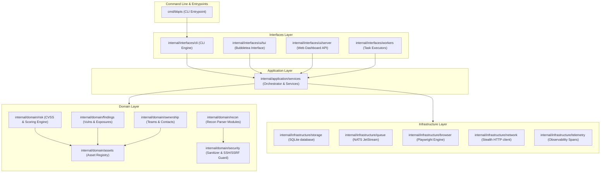
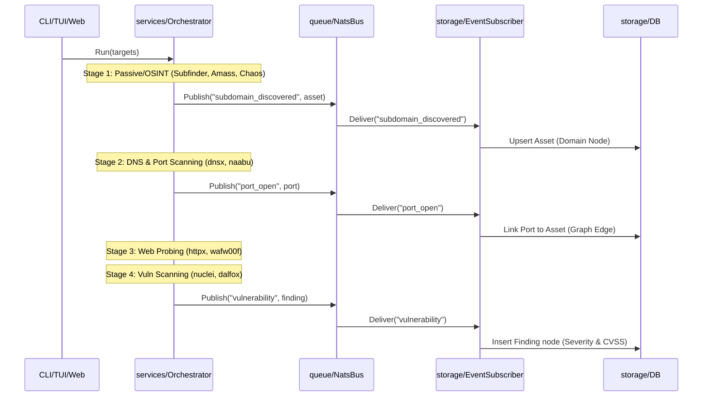

# BBPTS Architecture Guide

This document describes the layering, design patterns, and internal workflows of BBPTS.

## 1. Layered Architecture

The BBPTS codebase is structured around a strict layered architecture:



### Layer Responsibilities
* **CMD (Entrypoints)**: Handles startup configuration, command-line arguments parsing, and hands execution context off to the Interfaces layer.
* **Interfaces**: Adapts input/output for different run environments (CLI, Interactive TUI, Dashboard HTTP Server, or Stateless worker nodes).
* **Application**: Orchestrates core application workflows, executes recon tool wrappers in sequence, and handles background worker leases.
* **Domain**: Encapsulates core business rules, including target scope filtering, CVSS severity scores, asset relationships, state validation, and input sanitization.
* **Infrastructure**: Integrates with external systems and the underlying OS (SQLite database persistence, NATS pub/sub message brokers, headless Chromium, network client requests, and a homegrown telemetry tracer).

---

## 2. Reconnaissance Pipeline Workflow

The BBPTS orchestration pipeline executes four main sequential stages. Discovery events flow through NATS event streaming to build the target asset graph and register findings.



---

## 3. Security Model

Security is baked into the network clients, authentication mechanisms, and API boundary controls of BBPTS:

1. **SSRF Guard & Private IP Filtering**: The `StealthClient` network pipelines and custom client runner interfaces (e.g. Shodan, GitHub, Cloud Buckets, and Takeover tools) pass all requests through `security` package domain checks (IP validation and address resolution verification) before dispatching network calls. This prevents server-side request forgery (SSRF) and scanning of internal corporate endpoints.
2. **Loopback Bootstrap Bounds**: Critical bootstrapping endpoints (`/api/setup-token` and `/api/enroll`) are restricted strictly to loopback traffic (`127.0.0.1` and `::1`). External hosts attempting to request enrollment receive an HTTP 403 Forbidden.
3. **Session Hardening**: The dashboard sets `HttpOnly` and `SameSite=Strict` flags on session cookies (`bbpts_session`). Authentication tokens are matched against secure hashes in the database rather than being stored in plaintext client-side.
4. **CORS Restriction**: Wildcards are disallowed. CORS origins are validated dynamically against `127.0.0.1` and `localhost` with credential allowances.
5. **Input Sanitization**: External command arguments are run through custom shell-injection filters to prevent remote code execution (RCE) via command parameter inputs.

---

## 4. Event Bus Architecture

BBPTS relies on an event-driven core for loose coupling and scaling out across distributed nodes:

```
                  ┌───────────────────────────────┐
                  │      services/Orchestrator    │
                  └───────────────┬───────────────┘
                                  │
                  ┌───────────────▼───────────────┐
                  │        queue/NatsBus          │
                  └───────────────┬───────────────┘
                                  │
        ┌─────────────────────────┼─────────────────────────┐
        │                         │                         │
┌───────▼──────────────┐   ┌──────▼───────────────┐   ┌─────▼────────────────┐
│  EventSubscriber     │   │   LeaseManager       │   │  IdempotencyManager  │
│  (Saves to SQLite)   │   │  (Locks worker tasks)│   │(Avoids double execution)
└──────────────────────┘   └──────────────────────┘   └──────────────────────┘
```

* **NatsBus**: Wrapper around NATS JetStream. Manages pub/sub streams for real-time asset discovery, risk updates, and vulnerability notifications.
* **EventSubscriber**: Listens to structured events (e.g., `EventAssetDiscovered`, `EventFindingCreated`) and persists them synchronously to the SQLite DB.
* **LeaseManager**: Handles stateless worker locks on NATS task queues to coordinate distributed scans without overlap.
* **IdempotencyManager**: Prevents double-scanning of identical subdomains within the SLA interval window.
