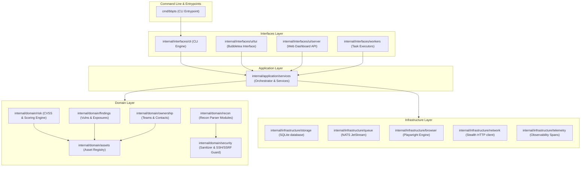

# BBPTS Architecture Guide

This document describes the layering and design patterns used across the BBPTS system.

## Layered Architecture Diagram

The BBPTS codebase is structured around a strict layered architecture:

## Description of Layers

1. **CMD (Entrypoints)**: Handles startup configuration, command-line arguments parsing, and hands execution context off to the Interfaces layer.
2. **Interfaces**: Adapts input/output for different run environments (CLI, Interactive TUI, Dashboard HTTP Server, or Stateless worker nodes).
3. **Application**: Orchestrates core application workflows, executes recon tool wrappers in sequence, and handles background worker leases.
4. **Domain**: Encapsulates core business rules, including target scope filtering, CVSS severity scores, asset relationships, state validation, and input sanitization.
5. **Infrastructure**: Integrates with external systems and the underlying OS (SQLite database persistence, NATS pub/sub message brokers, headless Chromium, network client requests, and OpenTelemetry).
