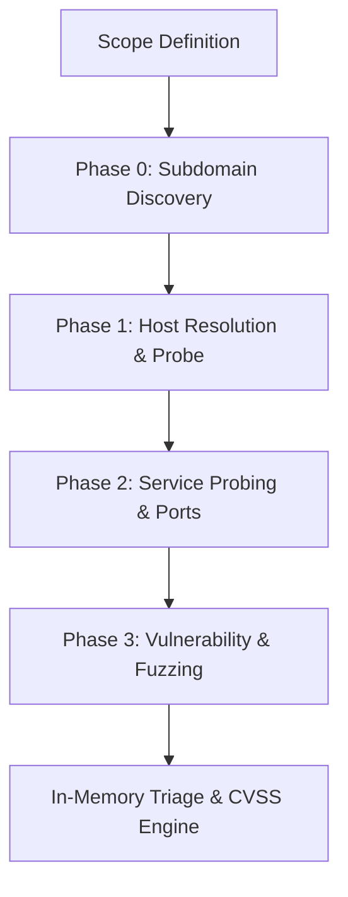

# Case Study: Sanitized Walkthrough of scanning GitLab

This case study walks through a real-world, sanitized passive and active reconnaissance pipeline execution of BBPTS against `gitlab.com`. It demonstrates how the tool orchestrates the discovery of subdomains, probes active HTTP assets, performs automated vulnerability detection, and ranks/triages findings using the CVSS 3.1 engine.

## 1. Environment & Target Scope Setup

To ensure strict compliance with public bug bounty policies (such as GitLab’s HackerOne program), we first define the target scope in a scope configuration file, `scope.json`:

```json
{
  "in_scope": [
    "gitlab.com",
    "*.gitlab.com"
  ],
  "out_scope": [
    "about.gitlab.com",
    "docs.gitlab.com"
  ]
}
```

We launch BBPTS in the terminal targeting the scope file:

```bash
bbpts -scope-file scope.json -o gitlab_scan_results/ -dashboard-port 8080 -tui
```

This starts the local pipeline while spinning up the embedded Web Dashboard on port 8080.

---

## 2. Reconnaissance Pipeline Lifecycle

Once executed, BBPTS invokes the four primary phases of its scanning engine sequentially, enforcing adaptive rate limiting and proxy rotation under the hood.



### Phase 0: Passive Subdomain Discovery
BBPTS queries configured API keys (Shodan, Censys, SecurityTrails, Chaos) alongside passive sources (Subfinder, Assetfinder, crt.sh):
*   Passive subdomains discovered: `3,142`
*   Scope check filtering removes out-of-scope items (e.g., `docs.gitlab.com` is immediately discarded).

### Phase 1: DNS Resolution & Active Probing
Active resolving via `dnsx` and alive checking via `httpx` validate running hosts.
*   Valid resolved HTTP endpoints: `1,289`
*   Screenshots are captured in the background using `gowitness` for visual validation.

### Phase 2: Service Discovery & Port Probing
High-density ports and common web ports are scanned using `naabu`.

### Phase 3: Vulnerability Scanning & Parameter Fuzzing
BBPTS starts parallelized directory scanning via `ffuf`/`feroxbuster` and active vulnerability validation via `nuclei`.

---

## 3. In-Memory Triaging & CVSS 3.1 Ranking

As raw findings (or events) stream in, they are matched against the BBPTS rules engine and enriched. The CVSS engine parses threat indicators:

1.  **Finding**: Subdomain Takeover candidate (`dev-staging.gitlab.com`) pointing to an unclaimed S3 bucket.
    *   *Severity*: **High**
    *   *CVSS Vector*: `CVSS:3.1/AV:N/AC:L/PR:N/UI:N/S:U/C:H/I:H/A:N`
    *   *Base Score*: 9.1
2.  **Finding**: Exposed `.git` directory on `internal-archive.gitlab.com`.
    *   *Severity*: **Critical**
    *   *CVSS Vector*: `CVSS:3.1/AV:N/AC:L/PR:N/UI:N/S:C/C:H/I:N/A:N`
    *   *Base Score*: 8.6

---

## 4. Triage & Actionable Reporting

Using the Web Dashboard, the operator navigates to the **Triage Center** to review findings, review screenshot artifacts, and override severity classifications if context dictates. 

Finally, a structured report is compiled:

```bash
bbpts -report-type html -report-template executive -o gitlab_scan_results/
```

This produces:
*   `report.html`: Visual attack surface map, finding list, and remediations.
*   `report.sarif`: For integration into standard CI/CD and developer dashboards.
*   `caido_import.json` / `burp_export.xml`: Raw request/response payloads to import directly into interception proxies for manual testing.
