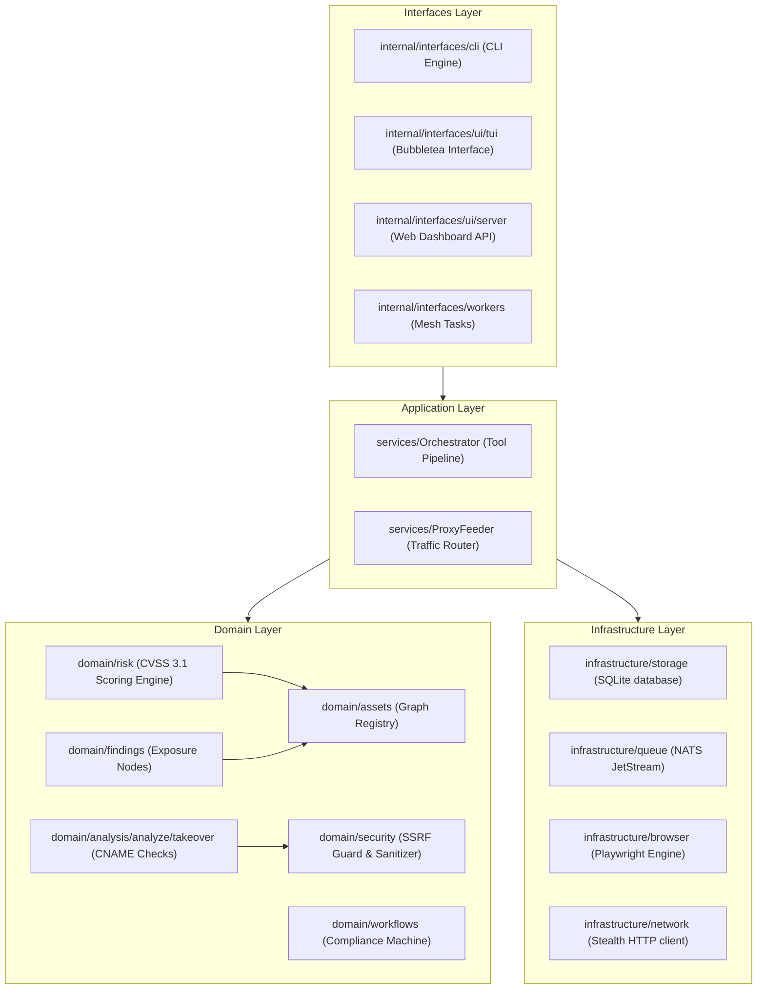
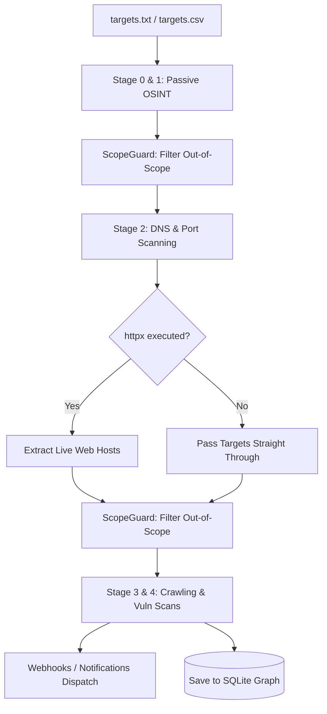

# BBPTS Master Technical Reference & Developer Guide

This document is a unified, high-density developer reference compiling system architecture, staging workflows, concurrency models, configuration parameters, rule engines, database schemas, Docker environments, and integration adapters for the BBPTS reconnaissance framework.

---

## 1. System Architecture & Layers

BBPTS implements clean layered architecture patterns to enforce separation of concerns, strict dependency boundaries, and high testability across components.



### Layer Core Responsibilities
* **Interfaces**: Translates presentation protocols (TUI CLI loops, REST API web requests, and mesh event subscriptions) to domain commands.
* **Application**: Dictates scanner orchestration, manages tool runtime concurrency, throttles network queues, and processes results.
* **Domain**: Houses business rules. Evaluates wildcard scope entries, computes CVSS risk vectors, and detects vulnerable dangling SaaS CNAME records.
* **Infrastructure**: Handles file state, transaction persistence, remote browsers, raw connections, and event queues.

---

## 2. Reconnaissance Pipeline & Gating Workflows

The orchestrator groups security tools into sequential execution stages (Stages 0 to 4). Active web probing stages are dynamically gated using live host discoveries.



### Stage Concurrency & Thread Allocation
* **Passive Stages (0 & 1)**: Multi-tool parallel execution up to the user-defined concurrency limit.
* **Active Stages (>= 2)**: Sequential execution (`maxConcurrentTools = 1`) to prevent local network limits and target WAF blocks.
  * The running tool utilizes the entire thread-pool: `toolThreads = threads`.

### Target Optimizers & Preprocessors
Prior to running a tool adapter, the orchestrator invokes preprocessors to clean and limit target payloads:
* **`uro`**: Filters for valid web protocols (`http` / `https`) and removes duplicate parameter profiles.
* **`dnsx` / `naabu`**: Deduplicates hosts and normalizes them into bare domain records.
* **Fuzzers (`ffuf` / `gobuster`)**: Automatically isolates the base URL and first-level subdirectory paths; hard-capped at **10** directory targets.
* **`dalfox`**: Limits testing to targets with active query string parameters (`?`); hard-capped at **20** targets.
* **`nuclei`**: Discards requests to static resources (`.css`, `.png`, `.woff`). Sorts targets by risk keywords (`admin`, `api`, `login`) and caps targets at **200**.

---

## 3. Tool Adapters & Integration Architecture

The framework interfaces with external binaries through a Registry pattern (`registry.go`). The execution pipeline wraps tool executions in Go context timers, panic-recovered routines, and token bucket limiters.

### Tool Registry Index
* **Passive / OSINT**:
  * `subfinder`: DNS discovery using passive OSINT providers.
  * `assetfinder`: GitHub/Git recon and subdomain harvesting.
  * `amass`: In-depth DNS and graph-based passive mappings.
  * `crtsh`: Extracts hosts from Certificate Transparency public logs.
  * `gau`: Retrieves historical URLs from Wayback, AlienVault, and CommonCrawl.
  * `chaos`: Fetches ProjectDiscovery Chaos data packages.
  * `tlsx`: Performs SSL/TLS certificate field analyses.
* **Active Probing & Resolution**:
  * `httpx`: Evaluates host port mappings, web servers, and titles.
  * `dnsx`: Bulk resolver translating domains to IP structures.
  * `naabu`: High-speed TCP/UDP port scanner.
  * `shodan`: Queries Shodan service indexes.
  * `wafw00f`: Fingerprints front-facing Web Application Firewalls.
* **Crawlers & Param Cleaners**:
  * `katana`: Crawls endpoints utilizing a headless JS browser engine.
  * `hakrawler`: Lightweight Go web crawler.
  * `browser`: Built-in crawler executing Playwright.
  * `gowitness`: Captures screenshots of live web views.
  * `uro`: Strips noise and cleans URL parameters.
* **Scanners & Fuzzers**:
  * `nuclei`: Runs active vulnerability templates.
  * `dalfox`: Parameter fuzzing specialized for XSS exposures.
  * `ffuf`: High-speed web fuzzing.
  * `gobuster` / `feroxbuster`: Directory and file brute-forcing.

### Developing Custom Tool Adapters
To introduce a new security scanner, implement the `Tool` interface inside `internal/application/services/`:

```go
package services

import "context"

type CustomScanner struct{}

func (c *CustomScanner) Name() string {
    return "custom_scanner"
}

func (c *CustomScanner) Run(ctx context.Context, targets []string, threads int) ([]Event, error) {
    // Implement execution wrapper (e.g. exec.CommandContext)
    // Map output text into Event slices
    return []Event{}, nil
}
```
Register the wrapper instance in `registry.go` and compile via `go build`.

---

## 4. Execution Resiliency & Checkpointing

### Staged Checkpoint Runs (`-resume`)
If a pipeline run is terminated (e.g. system signal, timeout, out-of-memory), developers can resume execution using the `-resume` flag. The orchestrator saves the execution state after each stage:
* Tracked data: list of completed stage numbers, current targets list, and event slice cache.
* File state is stored inside the `Checkpoint` directory.

### Circuit Breakers
To prevent slow network environments from hanging the pipeline, BBPTS registers a circuit breaker on each tool runner. If a tool encounters consecutive timeouts, its circuit breaker trips `open`, bypassing future target allocations.

---

## 5. Security Guardrails & API Rules

* **SSRF Guard (`ResolveAndValidateAddr`)**: Outbound HTTP clients evaluate destination hosts. Connection attempts to private addresses, loopbacks (`127.0.0.1`, `::1`), or private subnet blocks (`10.0.0.0/8`, `192.168.0.0/16`) are aborted.
* **Bootstrap Bounds**: Enrollment routes `/api/setup-token` and `/api/enroll` are hard-restricted to local loopback adapters. Requests from remote IPs receive `403 Forbidden`.
* **Cookie & CORS Policy**: Web dashboard cookies (`bbpts_session`) enforce `HttpOnly` and `SameSite=Strict` settings. CORS headers only allow validated local hosts (`localhost`, `127.0.0.1`), blocking wildcards.

---

## 6. SQLite Schema & Sync Interface

Local state persistence is handled by a CGo-free SQLite database engine (`modernc.org/sqlite`).

### Core Database Schema
* **scans**: Stores scan logs and statuses.
* **targets**: List of raw target strings.
* **events**: Log of discovery entries (`scan_id`, `target`, `source`, `type`, `properties` JSON).
* **asset_nodes**: Representation of domains, IPs, services, and findings inside the graph.
* **asset_edges**: Relationship map connecting assets (e.g., `Domain ➔ Port ➔ Web Service ➔ Vulnerability`).
* **finding_assignments**: Track team SLA policies, assignees, and compliance transition logs.

### Fleet Synchronization Interface
For distributed environments, local agents merge databases back to a centralized server using HTTPS sync transfers:

```
┌──────────────────┐           POST /api/fleet/sync (Multipart DB)           ┌──────────────────┐
│  Axiom Agent/CLI │ ──────────────────────────────────────────────────────> │ Master Dashboard │
│  (Local SQLite)  │              Header: X-Sync-Token: <token>              │  (Master SQLite) │
└──────────────────┘                                                         └──────────────────┘
```

The Master node authenticates the token, mounts the SQLite run file as a temporary storage adapter, and calls `services.ImportAndMergeDatabase` to append node/edge records.

---

## 7. Containerization & Docker Environments

BBPTS images bundle all 25+ tool dependencies for consistent deployment environments.

### Volume Mount Guidelines
```bash
docker run --rm -v $(pwd)/results:/app/results -v $(pwd)/configs:/app/configs bbpts:latest -i targets.txt
```

| Host Path | Mount Path | Purpose |
| :--- | :--- | :--- |
| `./results` | `/app/results` | Stores outputs (reports, CSV summaries, database state) |
| `./configs` | `/app/configs` | Loads local parameters and custom detection rules |
| `./wordlists` | `/app/wordlists` | Feeds custom fuzzing wordlists |

> [!CAUTION]
> Running active network checks inside Docker containers often requires `--network host` to allow raw socket access (e.g., for `naabu` or `massdns` DNS lookups). Headless browser scans (e.g. `gowitness`) require setting `--no-sandbox` flags inside container runtimes.

---

## 8. Parameter Schemas & Rule Configs

### Global Properties (`configs/config.json`)
The config controls system behaviors, notifications, API keys, and tuning variables:
* **`api_keys`**: Object. Stores API keys for third-party platforms (Shodan, Chaos, GitHub).
* **`tool_rate_limits`**: Object. Throttles specific tools individually (e.g. `{"nuclei": 10}`).
* **`resource_limits`**: Object. Configures hardware constraints (`max_cpu_percent`, `max_memory_mb`, `gc_percent`).
* **`tool_presets`**: Define tool subsets and timeouts for CLI profiles (e.g. `-preset passive`).

### Dynamic Rules Engine (`configs/rules.json`)
Allows developers to inject custom findings detection rules:

```json
{
  "rules": [
    {
      "id": "exposed-env",
      "description": "Exposed secrets configuration file",
      "priority": "critical",
      "conditions": [
        {
          "field": "target",
          "operator": "contains",
          "value": ".env"
        }
      ],
      "action": {
        "type": "tag",
        "tag": "exposed-secrets",
        "message": ".env file found; check for active credentials"
      }
    }
  ]
}
```

#### Condition API Operators
* **Fields**: `target`, `source`, `type`, or custom property keys.
* **Operators**: `equals`, `contains`, `starts_with`, `ends_with`, `not_contains`.

---

## 9. Verification & Diagnostics Commands

### Compilation & Diagnostics
```bash
# Build production executable
go build -o bbpts ./cmd/bbpts

# Doctor command verifying external binary paths
./bbpts -doctor
```

### Testing Configurations
```bash
# Run entire test suite
go test ./...

# Run race detector tests
go test -race -timeout 30s ./...

# View coverage metrics func-by-func
go test -coverprofile=coverage.out ./...
go tool cover -func=coverage.out
```

### Profile Performance
```bash
# Generate CPU profiles
go test -cpuprofile=cpu.prof ./...
go tool pprof cpu.prof
```

---

## 11. Technical Roadmap & Proposed Enhancements

To expand the framework's security depth and optimize contributor workflows, the following enhancement vectors have been prioritized:

### 11.1 Security Capabilities & Tool Extensions
* **`-cookie` Header Propagation**: Expand dynamic session cookies propagation from 16/33 active tools to include all HTTP-active wrappers.
* **CORS Misconfiguration Scanner**: Add a domain analyzer searching for permissive origins (`Access-Control-Allow-Origin: *` with credentials).
* **403 HTTP Bypass Engine**: Integrate automated tests trying standard header modification payloads (e.g. `X-Forwarded-For`, `X-Custom-IP-Authorization`) and path traversals on blocked endpoints.
* **JWT Analyzer (`-jwt-scan`)**: Build a payload parsing tool checking for weak signing keys, none-algorithms, and target claims modifications.
* **Cloud Storage Object Enumerator**: Add bucket discovery and ACL checking modules for public AWS S3, Google Cloud Storage, and Azure Blob containers.

### 11.2 Architectural Refactoring & Rules Engine
* **Decoupling God-Class Modules**: Split monolithic files `report.go` (~1,730 lines) and `app.go` (~1,661 lines) into dedicated service sub-modules (e.g., `report_html.go`, `report_json.go`, `report_csv.go`).
* **Rule Engine Action Types**: Extend `configs/rules.json` action options to include:
  * `"block"`: Suppress matching findings from final outputs.
  * `"elevate"`: Increase CVSS base scores or prioritize severities.

### 11.3 Pipeline Intelligence & Dynamic Stage Runs
* **Dynamic Stage Execution**: Instead of running fixed configurations, dynamically activate/deactivate Stage 3 & 4 tool instances based on Stage 2 outputs (e.g. bypass TLS-specific tools if port 443 is closed; bypass parameter scanners if no query string parameters are crawled).

### 11.4 Reporting & Continuous Monitoring
* **Diff Change Identification**: Enrich `-diff` mode comparison logs with a change-reason field (e.g. identifying if a host is newly resolved, has newly opened port assets, or returned an updated HTTP status code).
* **AI-Assisted Draft Mode**: Introduce an auto-generated reporting module utilizing CVSS scoring profiles to pre-populate bug bounty report drafts (HackerOne/Bugcrowd markdown templates).

