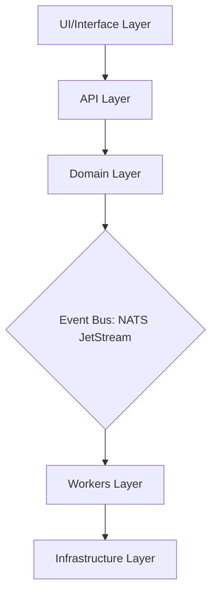
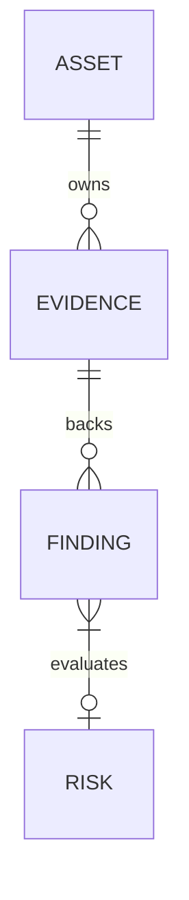
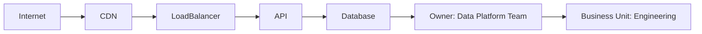
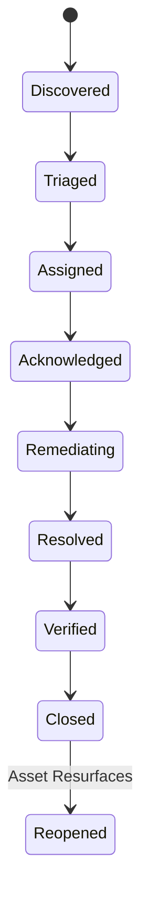

# BBPTS Architecture Rewrite & Hardening Implementation Plan

## Executive Summary
This document outlines the systematic engineering roadmap to transition BBPTS from a bug bounty recon tool into an enterprise-grade Continuous Threat Exposure Management (CTEM) and Attack Surface Management (ASM) platform.



---

## Phase 1 — Foundation & Event-Driven Core

### 1.1 Package Refactoring & Domain Separation
Establish strict layer boundaries to decouple business logic from transport and storage mechanisms.

* **Domain Layer (`internal/domain/`)**: Pure business models and logic, zero external infrastructure dependencies.
  * `assets/`: Asset identity, metadata, and drift detection.
  * `findings/`: Consolidated findings and evidence models.
  * `risk/`: Multi-factor risk engine and scores.
  * `ownership/`: Organizational ownership (Owner, Team, Business Unit).
  * `workflows/`: CTEM state machines and SLA definitions.
* **Infrastructure Layer (`internal/infrastructure/`)**: External drivers and database clients.
  * `database/`: PostgreSQL / Sqlite stores.
  * `queue/`: NATS JetStream and InMemory bus implementations.
  * `graph/`: Graph database integration.
* **Interface Layer (`internal/interfaces/` / `internal/application/`)**: Entrypoints and orchestration.
  * `api/`: REST endpoints.
  * `cli/`: Command-line tools.
  * `workers/`: Async queue consumers.

### 1.2 Event-Driven Architecture Implementation
Transition from direct function calls within the Orchestrator/CLI to an asynchronous, publish-subscribe model using NATS JetStream with an In-Memory fallback.

#### Event Definition Schema
```go
package queue

const (
	EventAssetDiscovered = "AssetDiscovered"
	EventHostAlive       = "HostAlive"
	EventFindingCreated  = "FindingCreated"
	EventFindingVerified = "FindingVerified"
	EventFindingClosed   = "FindingClosed"
	EventRiskChanged     = "RiskChanged"
	EventOwnerAssigned   = "OwnerAssigned"
)

type Event struct {
	Type       string            `json:"type"`
	Target     string            `json:"target"`
	Source     string            `json:"source"`
	Timestamp  time.Time         `json:"timestamp"`
	Properties map[string]string `json:"properties"`
	Data       []byte            `json:"data,omitempty"`
}
```

#### Event Router & Handlers
Introduce decoupling workers that subscribe to queue events and perform actions reactively:
* **Asset Handler**: Listens to `AssetDiscovered` to trigger port scanning or domain resolution.
* **Finding Handler**: Listens to `FindingCreated` to trigger risk evaluation.
* **Risk Engine Handler**: Listens to `RiskChanged` to evaluate critical SLA rules.

---

## Phase 2 — Data Model Rebuild

### 2.1 Evidence-First Data Model
Transition all data generation to derive from immutable, cryptographic evidence.



* **Evidence Model**:
  ```go
  type Evidence struct {
      ID          string    `json:"id"`
      AssetID     string    `json:"asset_id"`
      Source      string    `json:"source"`
      Confidence  float64   `json:"confidence"`
      CollectedAt time.Time `json:"collected_at"`
      RawData     []byte    `json:"raw_data"`
      Hash        string    `json:"hash"`
  }
  ```
* **Finding Model**:
  ```go
  type Finding struct {
      ID            int64    `json:"id"`
      AssetID       string   `json:"asset_id"`
      RiskScore     int      `json:"risk_score"`
      Confidence    int      `json:"confidence"`
      EvidenceIDs   []string `json:"evidence_ids"`
      WorkflowState string   `json:"workflow_state"`
  }
  ```

---

## Phase 3 — Multi-Factor Risk Engine V2

### 3.1 Formula Formulation
$$\text{Risk} = \text{Exposure} \times \text{Exploitability} \times \text{Business Impact} \times \text{Confidence} \times \text{Attack Path}$$

* **Exposure Factor**: Evaluates internet-facing status, authentication requirements, and data sensitivity.
* **Exploitability Factor**: Cross-checks known CVEs, public exploits (EPSS), and configuration checks.
* **Business Impact Factor**: Determines environment (production vs dev), revenue impact, and PII presence.
* **Confidence Factor**: Computed dynamically from evidence volume and verification state.
* **Attack Path Factor**: Derived from the blast radius and graph distances from public entrypoints.

---

## Phase 4 — Graph Intelligence Engine

### 4.1 Topology Design
Implement a directed graph mapping the organizational and infrastructural attack surface.



* **Ownership Graph**: `Asset -> Team -> Business Unit -> Executive Owner`
* **Technology Graph**: `Host -> Service -> Repo -> Developer Team`
* **Attack Graph**: `Internet -> Perimeter -> App -> Crown Jewels`

---

## Phase 5 — ASM & Drift Detection

### 5.1 Continuous Discovery
State tracking across chronological runs to detect baseline drift.
* **Drift Events**: `new_subdomain`, `new_service`, `port_change`, `tls_change`, `dns_change`.
* **Verification Alerts**: High-severity alerts fired on NATS when state transitions occur without an approved change window.

---

## Phase 6 — CTEM Workflows & SLA Engine

### 6.1 State Machine Transition Matrix
Strictly enforce the CTEM transition lifecycle.



* **SLA Timeframes**: Critical (7 days), High (14 days), Medium (30 days), Low (90 days).
* **Escalation Paths**: Dynamic alerting routing through `Owner -> Manager -> Director -> Executive` based on organizational charts.

---

## Phase 7 to 11 — Scalability, Identity & Testing

* **PostgreSQL & Redis Integration**: Replace flat-file storage with persistent relational tables and cache caches.
* **OpenTelemetry Observability**: Instrument metric tracking and trace spans for asynchronous worker jobs.
* **Supply Chain Hardening**: Cryptographically verify external binaries and check hashes before runtime.
* **Security & Performance Testing**: 90%+ test coverage, E2E flow testing, and scalability testing under 100k+ assets.
